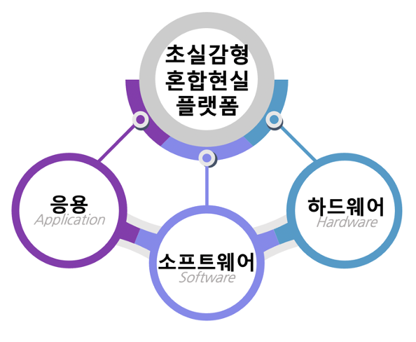

### 초실감형 혼합현실이란

기존의 가상 세계를 중점적으로 이루어지는 게임, 아바타 중심의 응용에서 벗어나 

**사용자의 현실에 스며들고** **지각 능력의 한계를 넘을 수 있는** 도움을 주는 기술입니다


### 초실감형 혼합현실 플랫폼의 구현은

**응용** **-** **소프트웨어** **-** **하드웨어**를 넘나드는 **전반적인 이해**를 요구합니다

따라서 각 분야의 전문가들의 유기적인 협력만이 구현을 실제화할 수 있습니다




<!-- 초실감형 혼합현실 센터

The **Second Brain** starter template empowers you to easily create **personal notes** and **knowledge bases** in a future-proof way.

- It is your second brain 🧠, stored in future-proof Markdown files 
- Supports audio, video, images, math, code, [Mermaid](https://mermaid.live/) diagrams, and [much more](https://wowchemy.com/docs/content/writing-markdown-latex/)
- Edit your notes online in GitHub, or any Git-connected Markdown app such as [Obsidian](https://obsidian.md/) or [Visual Studio Code](https://vscode.dev/)

```markmap {height="200px"}
- Second Brain
  - **powerful** knowledge base
  - **easy**: just plain text Markdown files
  - all your thoughts are **connected**
  - highly **extensible**
  - **future-proof** & open source ❤️
```

## Public vs Private Second Brain

Choose between **publishing and sharing your knowledge online or creating a private second brain**.

To create an **open second brain**, share your knowledge with others [by deploying this template](https://wowchemy.com/hugo-themes/) as a public website.

To create a **private second brain** either:

- After deploying your site above, [password protect your online second brain](https://docs.netlify.com/visitor-access/password-protection/) and configure your GitHub repo as **private**
- [Download this template](https://github.com/wowchemy/hugo-second-brain-theme) and [run the tool locally](https://wowchemy.com/docs/getting-started/install-hugo-extended/)

## Example notebook

 -->
